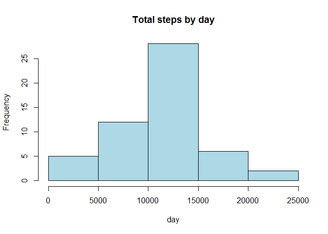
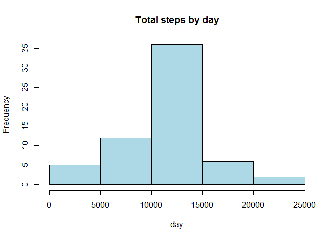

# Reproducible Research - Peer Assessment 1
### Set working directory, Load and Process data:


```r
setwd("C:/Users/Catarina/Desktop/Specialization in Data Science/05. Reproducible Research/02. Week 2/Assignment")

activity <- read.csv("activity.csv",colClasses = c("numeric","character","numeric"))
activity$date <- as.Date(activity$date, "%Y-%m-%d")
```

### What is mean total number of steps taken per day?
#### Make a histogram of the total number of steps taken each day


```r
## Agregate data (steps by day)
steps <- aggregate(steps ~ date, data = activity, sum, na.rm = TRUE)

## Plot data
library(lattice)
hist(steps$steps, main = "Total steps by day", xlab = "day", col = "light blue")
```

 

#### Calculate and report the mean and median total number of steps taken per day


```r
## Calculate Mean
mean(steps$steps)
```

```
## [1] 10766.19
```

```r
## Calculate Median
median(steps$steps)
```

```
## [1] 10765
```

### What is the average daily activity pattern?
#### Make a time series plot (i.e. type = "l") of the 5-minute interval (x-axis) and the average number of steps taken, averaged across all days (y-axis)


```r
## Agregate data (steps by interval)
interval <- aggregate(steps ~ interval, data = activity, FUN = mean)

## Plot data
plot(interval, type = "l")
```

 

#### Which 5-minute interval, on average across all the days in the dataset, contains the maximum number of steps?


```r
## Calculate 5 minute interval with Max number of steps
interval$interval[which.max(interval$steps)]
```

```
## [1] 835
```

### Imputing missing values
#### Calculate and report the total number of missing values in the dataset (i.e. the total number of rows with NAs)


```r
## Calculate number of missing values
sum(is.na(activity))
```

```
## [1] 2304
```

#### Devise a strategy for filling in all of the missing values in the dataset.

The strategy is to use the mean for that 5-minute interval to fill each NA value in the steps column.

#### Create a new dataset that is equal to the original dataset but with the missing data filled in.


```r
## Using the mean to fill missing values
newdata <- merge(activity, interval, by = "interval", suffixes = c("",".y"))
nas <- is.na(newdata$steps)
newdata$steps[nas] <- newdata$steps.y[nas]
newdata <- newdata[, c(1:3)]
```

#### Make a histogram of the total number of steps taken each day and Calculate and report the mean and median total number of steps taken per day.


```r
## Agregate data (steps by day)
stepsnew <- aggregate(steps ~ date, data = newdata, FUN = sum)

## Plot data
hist(stepsnew$steps, main = "Total steps by day", xlab = "day", col = "light blue")
```

 

```r
## Calculate Mean
mean(stepsnew$steps)
```

```
## [1] 10766.19
```

```r
## Calculate Median
median(stepsnew$steps)
```

```
## [1] 10766.19
```

#### Do these values differ from the estimates from the first part of the assignment? What is the impact of imputing missing data on the estimates of the total daily number of steps?

After filling the missing data, there's no change in the mean but the new median is greater.Also after filling the missing values, the mean is equal to the median.

### Are there differences in activity patterns between weekdays and weekends?
#### Create a new factor variable in the dataset with two levels -- "weekday" and "weekend" indicating whether a given date is a weekday or weekend day.


```r
## Create a new factor variable in the dataset with two levels – “weekday” and “weekend
day <- weekdays(activity$date)
daylevel <- vector()
for (i in 1:nrow(activity)) {
  if (day[i] == "sábado") {
    daylevel[i] <- "Weekend"
  } else if (day[i] == "domingo") {
    daylevel[i] <- "Weekend"
  } else {
    daylevel[i] <- "Weekday"
  }
}
activity$daylevel <- daylevel
activity$daylevel <- factor(activity$daylevel)
```

#### Make a panel plot containing a time series plot (i.e. type = "l") of the 5-minute interval (x-axis) and the average number of steps taken, averaged across all weekday days or weekend days (y-axis).


```r
## Agregate data
stepsday <- aggregate(steps ~ interval + daylevel, data = activity, mean)
names(stepsday) <- c("interval", "daylevel", "steps")

## Plot data
xyplot(steps ~ interval | daylevel, stepsday, type = "l", layout = c(1, 2), 
       xlab = "Interval", ylab = "Number of steps")
```

 
